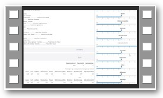
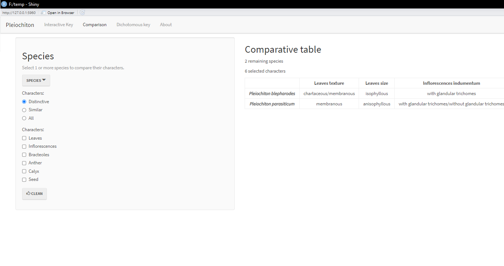

In this tutorial we are going over basic steps to build two types of identification keys using monographaR: dichotomous keys (dichoKey and dichoKey.app) and an interactive key (interactiveKey).


## Preliminaries

### Loading the package


```{r, message=FALSE, warning=FALSE}
library(monographaR)
```


### Working directory

```{r, eval=FALSE}
setwd("C:/My_working_directory")
```


### Input examples

Within monographaR there are examples of input formatted spreadsheets to use in both functions to build keys (dichoKey and interactiveKey). To load and visualize these models type:

```{r, eval=FALSE}
data("monographaR_examples")
head(monographaR_examples$dichoKey)
head(monographaR_examples$interactiveKey)
```

It is possible to export these models to open in other software (e.g., Excel). To export these models type:  

```{r, eval=FALSE, tidy=FALSE}
data("monographaR_examples")
write.csv(monographaR_examples$dichoKey, file="dichoKey_model.csv", row.names=F)
write.csv(monographaR_examples$interactiveKey, file="interactiveKey_model.csv", row.names=F)

```

## dichoKey

This function will generate a dichotomous key. It wraps around the function "rpart" from the package rpart ([details here](https://CRAN.R-project.org/package=rpart)) to generate a more "taxonomic" styled key. 

### Input

*Importing the data*

```{r, eval=FALSE, tidy=TRUE, results='asis'}

read.csv("dichoKey_model.csv") -> dat

```

```{r, echo=FALSE}
data("monographaR_examples")
monographaR_examples$dichoKey -> dat
as.matrix(dat) -> dat
dat[which(dat == "")] <- NA
data.frame(dat) -> dat
```


*This is the format of the table:*

```{r, echo=FALSE, results='asis'}
data(monographaR_examples)
monographaR_examples$dichoKey -> data
knitr::kable(head(data[,1:5], 5), align="l")
```

If your dataset includes species with polymorphic characters (that is usually the case), first is necessary to format the data using the function "dataKey". To use this function the user is required to provide what is the character used to indicate the polymorphics. In this example here I used a "/". It is also possible to include characters with missing data, these should be as "NA".


```{r, tidy=TRUE, results='asis'}
### First let's include the column name of the first column (where the species name is stored) 
colnames(dat)[1] <- "species"

### Now just run the function 

dataKey(dat, poly.sep = "/") -> dat.k
dat.k$dat -> dat.p
```

*Notice that the function reports the percent of polymorphic characters (including the ones with missing data)*

With the fully formatted matrix, now you can just run the function with the following command:   


```{r, tidy=TRUE, message=FALSE, eval=FALSE}

dichoKey(dat.p) -> key

```

*This is the output*

__________________________________________________________

```{r, echo=FALSE, message=FALSE}
dichoKey(dat.p) -> key
cat(key$key, sep="\n")

```

__________________________________________________________


```{r, tidy=TRUE, message=FALSE, results='asis'}

### It is possible to check if there was any unresolved species 

### which?

key$unresolved

### how many?

length(key$unresolved)

```

### Export

To export the key as plain text just type the following command: 

```{r, eval=FALSE}
cat(key$key, file="Pleiochiton_key.txt")
```


### Adding costs

It is possible to provide "costs" for each character used to build the key. In order to do that, it is required to provide a vector (numeric) with the cost values of each character, where the higher is the cost the lower will be its priority to build the key. Any type of cost scheme would be accepted. In this example let's penalize the characters with more polymorphic/missing data (increasing their costs in relation to the other characters).

```{r, tidy=TRUE, message=FALSE, results='asis'}

## The percent of polymorphic spp. for each character was generated before (dataKey) and stored in theobject "dat.k"

dat.k$summary
((dat.k$summary)+1) -> dat.c
colnames(dat.p)
dat.c[2] <- max(dat.c)
dat.c[11] <- max(dat.c)

dichoKey(dat.p, dat.c, cp=0) -> key.c
length(key.c$unresolved)

# Export

cat(key.c$key, file="Pleiochiton_key_costs.txt")

```


## dichoKey.app

This function is a shiny app that runs the function "dichoKey" in the background. It allows the user to easily subset the data (taxa and characters), as well as change the cost values of the characters. To open the App just type:

```{r, eval=FALSE}
dichoKey.app()
```

Then you can select a csv file (formmated similarly to "monographaR_examples$dichoKey"). *Here is a demo video showing how to use the function:*

<center>

[{width=40%, align="center"}](http://htmlpreview.github.io/?https://github.com/mreginato/monographaR-demos/blob/main/dichoKey_app.html)

</center>

## interactiveKey


This function will generate all the necessary files to build a "shiny app" that includes the interactive key. This "app" can be executed locally (see bellow) or online. To deploy online your app see details in [shiny](https://docs.posit.co/shinyapps.io/).

### Input

*Importing the data*

```{r, eval=FALSE,  tidy=TRUE, results='asis'}

read.csv("interactiveKey_model.csv") -> dat

```

```{r, echo=FALSE}
data("monographaR_examples")
monographaR_examples$interactiveKey -> dat
as.matrix(dat) -> dat
dat[which(dat == "")] <- NA
data.frame(dat) -> dat
```


*This is the table format:*

```{r, echo=FALSE, results='asis'}
data(monographaR_examples)
monographaR_examples$interactiveKey -> data
knitr::kable(head(data[,1:5], 5), align="l")
```

If your dataset includes taxa with polymorphic characters (usually does), make sure you have a special character separating polymorphisms. In this example polymorphic characters are separed by a "/". 

__________________________________________________________

### Labels 

Before running the function to build the app, first we need to run an accessory function to generate standard "labels" for the three different types included in the function (families, genera, species). This is done with the function "interactiveKeyLabels", which generates model labels in english and portuguese. In the next example, my characters are in english and this was supposed to be a key for species identification, thus the following code applies: 


```{r, tidy=TRUE, message=FALSE, eval=FALSE}

interactiveKeyLabels(taxon = "species", language = "english") -> spp.eng.labs

### It would be possible to export the object "spp.eng.labs" (e.g., with write.csv), change the labels accordingly and import it again to use in the next step

### Let's change the "title" (default is "My taxon")

head(spp.eng.labs)
spp.eng.labs[3] <- "Pleiochiton"
head(spp.eng.labs)

```


### Generate the app

With the formatted matrix and labels, now it is possible to generate the required files for the interactive key shiny app to work. 
This is done with the following command: 

```{r, tidy=TRUE, message=FALSE, eval=FALSE}

interactiveKey(dat = dat, txt.labels = spp.eng.labs, poly.sep = "/", taxa.in.italics = TRUE, theme = "lumen")

```

If everything went smoothly, this command will generate in your working directory the following files: 

* about.Rmd
* app.R
* Dat_characters.csv
* Dat_matrix.csv
* Dat_matrix_missing.csv
* server.R
* ui.R

### Open the app

To open and test the app, in Rstudio go to "File" \Rightarrow  "Open file" e select the file "app.R". When this file is opened, a new option ("Run App") will become availble in the upper right corner. To start the app just click in that button and a new window with the app will pop up. 

{width=100%}

__________________________________________________________

The app:

{width=100%}

{width=100%}
{width=100%}

*See other "theme" options in [shinythemes](https://shiny.posit.co/r/gallery/application-layout/shiny-theme-selector/).*

### About

The file "about.Rmd" should be edited (include there whatever you feel deserves to be there). Editing can be done in a simple text editor or in Rstudio. To edit it in Rstudio, go to "File" \Rightarrow  "Open file" e select the file. After finishing editing, you can check how it will be compiled. Just click in "Knit".

{width=100%}

### Demo

*Here is a demo video showing how to use the function:*

<center>
[{width=40%, align="center"}](http://htmlpreview.github.io/?https://github.com/mreginato/monographaR-demos/blob/main/interactiveKey.html)
</center>

### Example

Here is an example of an interactive key that was build with this function:

[*Chamaecrista*](https://julianarando.shinyapps.io/chave_fbo2020/)